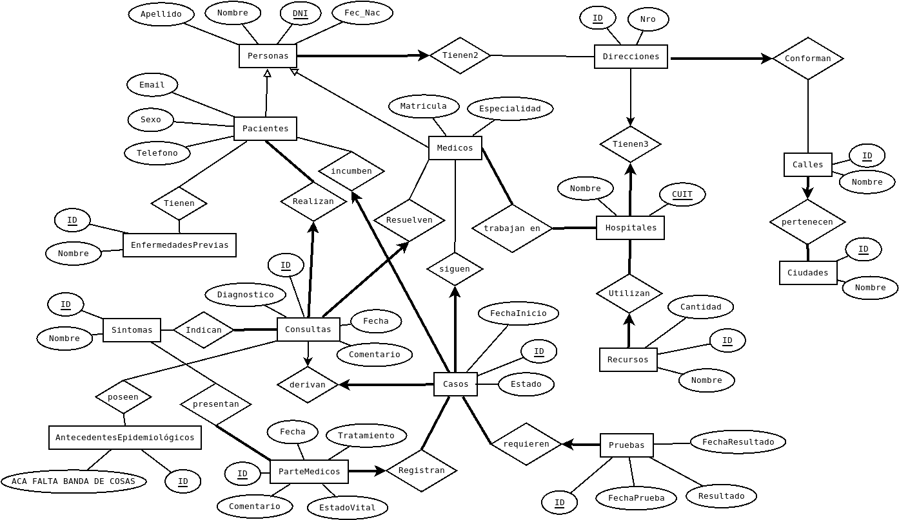
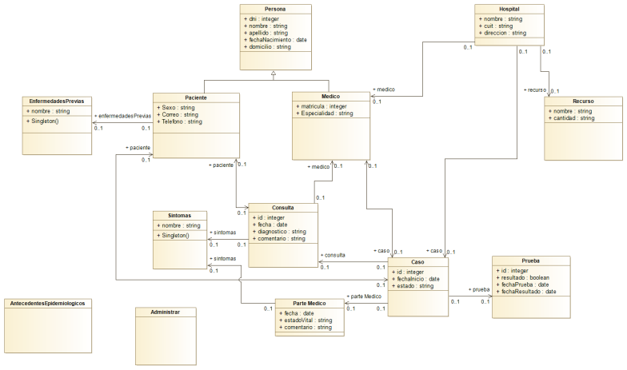

# TPI-DACS
Trabajo práctico integrador de Desarrollo de Aplicaciones Cliente Servidor

# Escenario
En medio de la pandemia de COVID-19, el ministerio de salud de la provincia del Chaco ha solicitado a los alumnos de la cátedra Desarrollo de Aplicaciones Cliente-Servidor el diseño e implementación de un sistema que permita conectar a tres actores muy importantes en la lucha contra el virus: los pacientes, los centros hospitalarios y el ministerio de salud de la provincia.

### Paciente
Los pacientes podrán recibir información sobre el estado de la pandemia y recomendaciones por parte del ministerio de salud. Por otro lados, los pacientes pueden hacer consultas a los centros hospitalarios y reportar síntomas que les permita determina si es necesario que se acerquen a los centros a realizarse test para detectar casos de COVID-19.
### Centros hospitalarios
Los médicos de los centros hospitalarios puede tomar las consultas realizadas por los pacientes y, en base a los síntomas y su experiencia médica determinar si es un caso sospechoso de COVID-19. Si el ministerio así lo terminase, un profesional puede ser asignado al seguimiento de los caso confirmados de COVID-19.
### Ministerio de salud de la provincia
El ministerio recibe de todos los centros hospitalarios los reportes de casos sospechosos reportados por los pacientes y validados por los profesionales de la salud. En base a esta información, y la disponibilidad de recursos, el ministerio asigna recursos de los centros hospitalarios para el seguimiento y detección de casos de COVID-19. Por otro lado, genera reportes sobre el estado y evolución de casos positivos y sospechosos en forma diaria y en tiempo real.

# Instalación

### Clonar el repositorio.

### Instalar dependencias **(hacer siempre para confirmar)**:
npm i

### Si no funciona, instalar nodemon de alguna de estas maneras:
npm i nodemon -D
o?
sudo npm install -g --force nodemon
o
npm install -g nodemon --save-dev

### Correr el proyecto (fase de desarrollo):
npm run dev

**Construir el proyecto (version con soporte en navegadores):**
npm run build

**Correr el proyecto (el de produccion):**
npm run start

### Arquitectura implementada:

### Diagrama Entidad Relación:

### Diagrama de Clase:

=======
=======
# 2020-G3-TPI
Trabajo práctico Integrador - Grupo 3 - 2020
=======